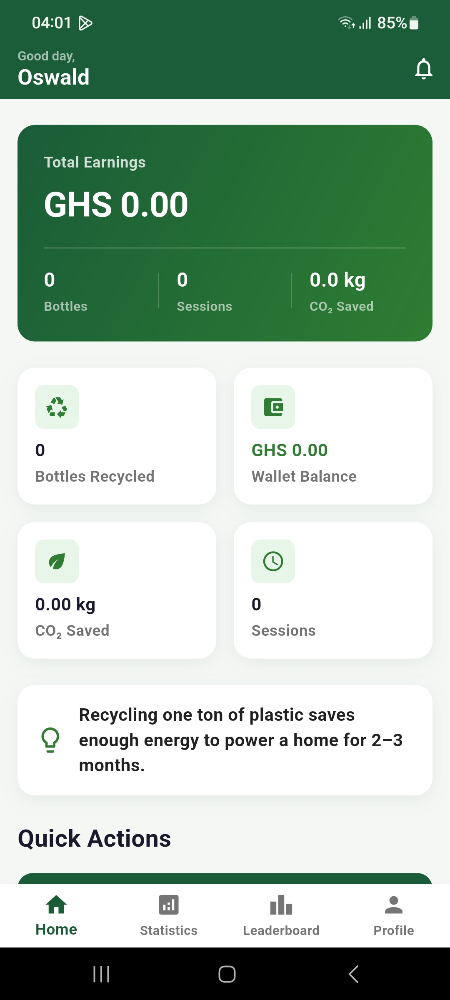
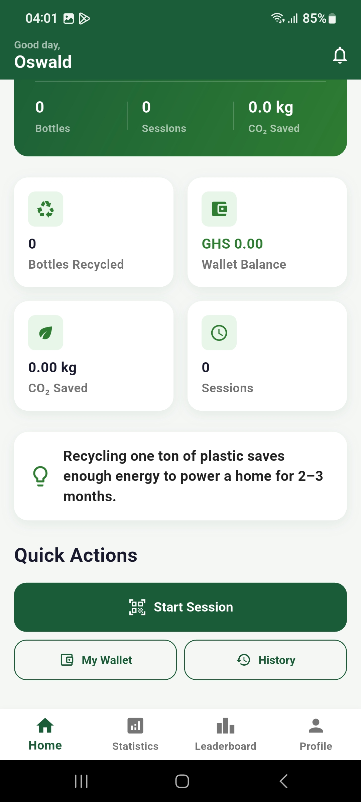
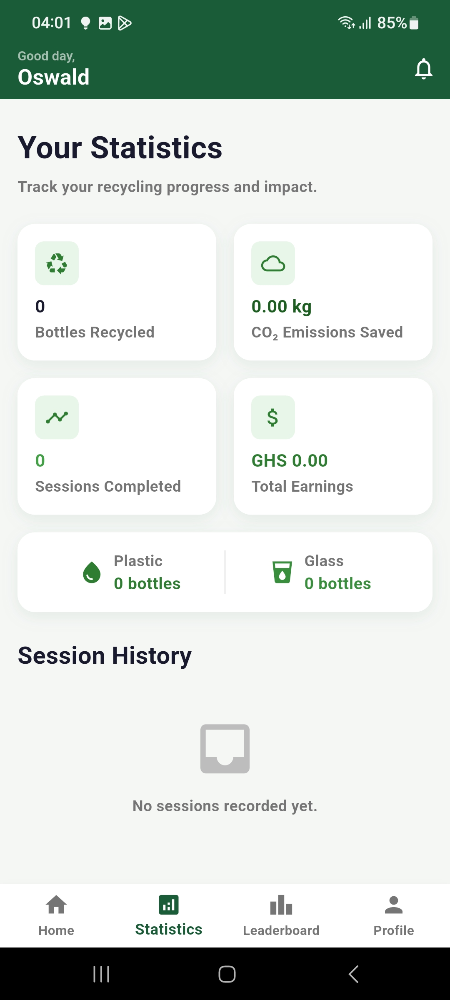
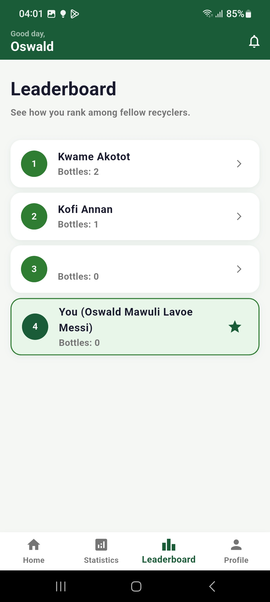
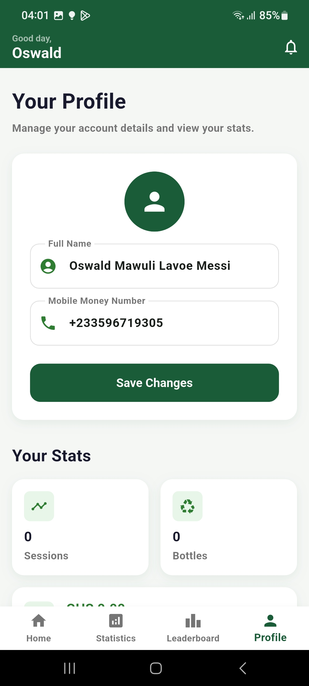
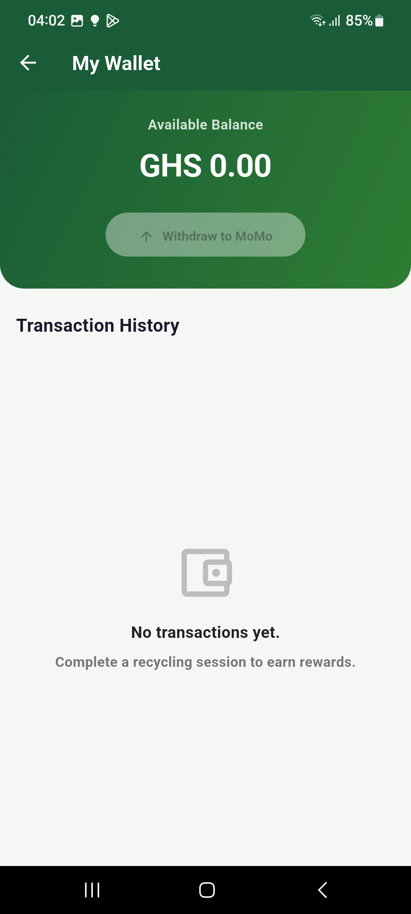
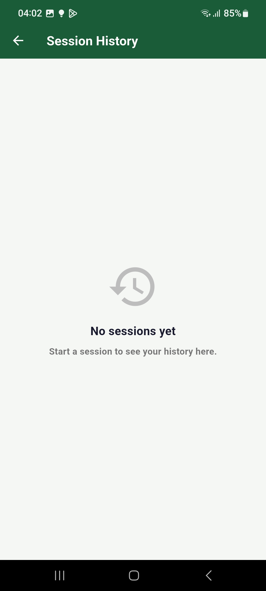

# VERIDIS — Virtual Environmental Recycling Incentive and Disposal Intelligence System

A smart waste segregation system that automatically classifies and sorts plastic and glass bottles, and rewards users in Ghanaian Cedis via MTN Mobile Money. Built as a final-year Bachelor of Science project at Academic City University, Ghana.

**Authors:** Oswald Mawuli Lavoe, Obour Adomako Tawiah, Yaw Acheampong Ahenkora Gyamera
**Supervisor:** Mr. Kwesi Crankson 
**Institution:** Academic City University College, Ghana
**Year:** 2026

---

## Table of Contents

- [Project Overview](#project-overview)
- [Problem Statement](#problem-statement)
- [Objectives](#objectives)
- [Key Features](#key-features)
- [System Architecture](#system-architecture)
- [Hardware Components](#hardware-components)
- [Software Stack](#software-stack)
- [User Workflow](#user-workflow)
- [Sensor Fusion Strategy](#sensor-fusion-strategy)
- [UI/UX Designs](#uiux-designs)
- [Application Screenshots](#application-screenshots)
- [Challenges and Solutions](#challenges-and-solutions)
- [Future Improvements](#future-improvements)
- [Lessons Learnt](#lessons-learnt)
- [My Role](#my-role)
- [Project Structure](#project-structure)
- [Installation and Setup](#installation-and-setup)
- [Resources](#resources)

---

## Project Overview

VERIDIS is an integrated recycling system consisting of a physical Reverse Vending Machine (RVM) and a companion mobile application. Users deposit plastic or glass bottles into the machine, which automatically identifies and sorts the material. Once a session is completed, the user receives a monetary reward directly to their mobile wallet, which can be withdrawn via MTN Mobile Money.

The system was designed specifically for urban communities in Ghana, where recyclable waste is abundant but proper disposal infrastructure and behavioral incentives are lacking. VERIDIS combines hardware automation, computer vision, and mobile money payments to make recycling accessible, rewarding, and trackable.

---

## Problem Statement

Ghana generates over 1.1 million tonnes of plastic waste annually, yet less than 10% is recycled. In urban communities, studies show that up to 97% of collected waste is recyclable, yet surveys conducted during this project found that 55% of people still dispose of waste improperly. The key barriers are not awareness — 89% of respondents were aware of recycling — but the absence of infrastructure, convenience, and tangible incentives.

Existing waste collection methods rely on manual sorting, which is inconsistent, labor-intensive, and prone to contamination. There is no mechanism that rewards individuals for proper disposal at source, and no real-time visibility into bin fill levels or material throughput.

VERIDIS addresses this gap by automating sorting at the point of deposit and providing immediate mobile money rewards to drive participation.

---

## Objectives

1. Design and build a functional Reverse Vending Machine that automatically classifies and sorts plastic and glass bottles using sensor fusion.
2. Develop a mobile application that allows users to start recycling sessions, track their environmental impact, and manage earnings.
3. Implement a mobile money reward system that credits users in Ghanaian Cedis upon completing a session.
4. Build an admin dashboard for monitoring bin fill levels, managing users, and processing withdrawal requests.
5. Validate system classification accuracy against a 90% benchmark through structured testing.
6. Assess user willingness to adopt the system through surveys and usability testing.

---

## Key Features

**Hardware (Reverse Vending Machine)**
- Automatic bottle detection using an IR break-beam sensor at the machine entry point
- AI-powered visual classification using a HuskyLens camera (trained on plastic and glass bottles)
- Transparency detection using a digital Light-Dependent Resistor (LDR) sensor to complement the camera
- Automated mechanical sorting via 6 servo motors routed through a gravity-fed chute
- Real-time TFT touchscreen display showing session status, result feedback, and a QR code for app pairing
- Proximity sensors monitoring bin fill levels for both plastic and glass compartments
- RGB LED indicators providing immediate visual feedback per bottle (green = accepted, red = rejected)

**Mobile Application**
- User registration and login with Firebase Authentication
- QR code scanning to pair a phone with a specific machine and start a session
- Live session tracking showing each bottle processed, material type, and earnings accumulated
- Wallet system with instant credit upon session completion
- MTN Mobile Money withdrawal with admin approval workflow
- Leaderboard ranking users by total bottles recycled
- Personal statistics showing total bottles, CO2 saved, earnings, and session count
- Admin panel for platform oversight, user management, bin monitoring, and payout processing
- Push notifications for wallet credits and bin fill alerts

---

## System Architecture

The system is built across four layers:

```
Presentation Layer
  Flutter Mobile App (Android/iOS/Web)
  TFT Touchscreen on the RVM
  Admin Dashboard (within the mobile app)

Application Layer
  Firebase Authentication & Firestore (real-time database)
  ESP32 HTTP REST API (session control)
  Paystack API (MTN Mobile Money payouts)

Data Layer
  Firestore Collections: users, sessions, walletTransactions, bins
  Offline persistence with unlimited local cache

Hardware & IoT Layer
  ESP32-WROOM-DA Microcontroller
  HuskyLens AI Camera, LDR, IR Break-Beam Sensor
  PCA9685 PWM Driver, 6x Servo Motors
  ILI9341 TFT Display, XPT2046 Touch Controller
  Proximity Sensors (bin monitoring)
```

The mobile app communicates with the ESP32 over a shared Wi-Fi network. When a user scans the machine QR code, the app sends an HTTP POST request to the ESP32 to begin the session. The ESP32 runs the state machine, classifies each bottle, and actuates the servo motors. Session data is written to Firestore by the mobile app upon session completion.

> See the full system architecture diagram in the thesis report (page referenced in [Resources](#resources)).

---

## Hardware Components

| Component | Model | Purpose |
|-----------|-------|---------|
| Microcontroller | ESP32-WROOM-DA | Central processing unit; runs state machine, controls all components |
| AI Camera | HuskyLens (DFRobot) | Visual classification of plastic vs. glass using KNN algorithm |
| Transparency Sensor | Digital Light-Dependent Resistor (LDR) | Detects whether a bottle is opaque (plastic) or transparent (glass) |
| Bottle Detection | IR Break-Beam Sensor | Detects when a bottle is inserted at the machine entry point |
| Servo Driver | PCA9685 (16-channel PWM, I2C) | Controls all 6 servo motors over I2C |
| Servo Motors | 6x Standard Servo | Entry gate (x2), bin flaps (x2), rejection flap (x1), bin divider (x1) |
| Display | ILI9341 2.4" TFT (SPI) | Shows session status, results, QR code, and machine feedback |
| Touch Input | XPT2046 Touch Controller | Capacitive touch for session control on the TFT screen |
| Bin Monitoring | Proximity Sensors (x2) | Detects fill level in plastic bin (GPIO 26) and glass bin (GPIO 27) |
| RGB LEDs | Common Cathode (x2) | Visual feedback: green = accepted, red = rejected, white = scanning |
| Power Supply | 24V + two buck converters | 6V rail for servos, 5V rail for logic and sensors |

**Physical Machine:**
- Dimensions: 5 feet tall, 4 feet long, 2 feet wide
- Material: Plywood exterior, corrugated cardboard internals
- Chute angle: 28 degrees for gravity-fed bottle movement

**Communication Buses:**
- I2C (SDA: GPIO 21, SCL: GPIO 22): HuskyLens, PCA9685
- SPI (CLK: GPIO 18, MOSI: GPIO 23, MISO: GPIO 19): TFT display, touch controller
- UART (115200 baud): Serial debugging output

> Note: The VL53L0X Time-of-Flight sensor and HX711 load cell were originally planned as additional classification inputs but were excluded from the final prototype. The ToF sensor encountered an I2C bus conflict, and the load cell could not be reliably calibrated or positioned within a gravity-fed chute. The system achieves its 96% accuracy using HuskyLens and LDR only.

---

## Software Stack

**Mobile Application**
- Framework: Flutter (supports Android, iOS, and Web)
- Backend: Firebase (Authentication, Firestore)
- Payment: Paystack API (MTN Mobile Money, demo mode in current build)
- QR Scanning: `mobile_scanner` package
- Deep Linking: `app_links` package (`veridis://` URI scheme)
- Notifications: `flutter_local_notifications`
- HTTP: `http` package (ESP32 communication)

**Embedded Firmware**
- Platform: Arduino (ESP32)
- Language: C++
- Key Libraries: `TFT_eSPI` (display), `Adafruit_PWMServoDriver` (PCA9685), `HUSKYLENS` (DFRobot), `QRCode` (ricmoo), `HX711` (bogde), `XPT2046_Touchscreen`

**Database Schema (Firestore)**

```
users/
  {uid}
    name, email, mobileMoneyNumber, createdAt
    totalBottleCount, totalEarnings, totalCo2Saved, sessionCount
    isAdmin (optional)

sessions/
  {sessionId}
    userId, machineId, startTime, endTime
    bottles: [{materialType, earnings, co2Saved, scannedAt}]
    totalEarnings, totalCo2Saved, bottleCount

walletTransactions/
  {transactionId}
    userId, type (credit | withdrawalRequest), amount
    description, isPending, timestamp
    mobileMoneyNumber, paystackTransferCode

bins/
  {binId}
    binId, location, fillPercent, lastUpdated, isActive
```

---

## User Workflow

The complete user journey from registration to withdrawal:

```
1. Register
   Enter full name, email, password, and MTN Mobile Money number

2. Login
   Authenticate via Firebase (email and password)

3. Home Dashboard
   View total earnings, bottles recycled, CO2 saved, and session count

4. Start a Session
   Tap "Start Session" → camera opens → scan the QR code on the machine
   App sends HTTP POST to ESP32 to begin session

5. Deposit Bottles
   Insert bottle into the machine chute
   Machine detects, classifies, and routes each bottle automatically
   App displays each bottle result (plastic / glass / rejected) in real time

6. End Session
   Tap "Done" in the app → session is saved to Firestore → wallet is credited
   GHS 0.50 per plastic bottle, GHS 0.30 per glass bottle

7. Withdraw Earnings
   Open wallet → "Withdraw to MoMo" → enter amount and MoMo number
   Request is submitted for admin approval

8. Admin Approves Payout
   Admin reviews pending withdrawals → approves → Paystack transfers funds to user's MoMo number
```

> See the full user flow diagram in the thesis report (page referenced in [Resources](#resources)).

---

## Sensor Fusion Strategy

The machine uses two sensors working together to classify each bottle. A majority agreement between both sensors determines the final result. If both sensors disagree, the bottle is rejected.

**Sensor 1 — HuskyLens AI Camera**
- Positioned at the machine entry point
- Trained using K-Nearest Neighbours (KNN) on 40 samples:
  - 15 clear plastic bottles
  - 10 coloured plastic bottles
  - 15 clear glass bottles
- Returns: Plastic (ID 1), Glass (ID 2), or no match (rejected)
- Accuracy: 90%+ across trained categories

**Sensor 2 — Digital Light-Dependent Resistor (LDR)**
- Positioned on the chute wall with an LED light source opposite it
- Glass is transparent, allowing more light to reach the sensor (digital HIGH)
- Plastic is opaque, blocking more light (digital LOW)
- Output is a digital signal — HIGH for glass/transparent, LOW for plastic/opaque

**Classification Decision**
```
Both agree on Plastic  → PLASTIC → routed to plastic bin
Both agree on Glass    → GLASS   → routed to glass bin
Both disagree          → REJECT  → routed to rejection chute
```

**Sorting Mechanism**
- Plastic: Bin divider stays neutral, flap servos open, bottle drops straight
- Glass: Bin divider rotates 60 degrees, flap servos open, bottle routes to glass side, divider returns
- Rejected: Rejection flap servo opens, bottle exits through rejection chute

**Classification Results from Testing**
| Category | Tested | Correct | Accuracy |
|----------|--------|---------|----------|
| Clear plastic bottles | 15 | 15 | 100% |
| Coloured plastic bottles | 10 | 10 | 100% |
| Clear glass bottles | 15 | 15 | 100% |
| Non-bottle items | 5 | 4 | 80% |
| Soiled or damaged bottles | 3 | 2 | 66.7% |
| **Overall** | **50** | **48** | **96%** |

Processing time per bottle: 3 to 5 seconds.

---

## UI/UX Designs

The following screens are from the original Figma design prototype created before development. The final application follows these designs closely with adjustments made during implementation.

**Splash / Welcome Screen**


---

**Login Screen**


---

**Sign Up Screen**


---

**Home Dashboard — Impact Overview**


---

**Statistics — Waste Journey**


---

**Leaderboard — Top Recyclers**


---

**Profile Screen**


---

## Application Screenshots

The following screenshots are from the live application running on an Android device.

**Home Screen — Dashboard**

Displays total earnings, bottles recycled, CO2 saved, session count, and quick action buttons.



---

**Home Screen — Quick Actions**

Shows the Start Session, My Wallet, and History quick action buttons below the dashboard metrics.



---

**Statistics Screen**

Tracks the user's full recycling history including bottles by material type, total CO2 saved, earnings, and session count.



---

**Leaderboard Screen**

Ranks all users by total bottles recycled. The current user is highlighted in a distinct card.



---

**Profile Screen**

Allows the user to update their name and Mobile Money number, and view their session statistics.



---

**Wallet Screen**

Shows available balance, a withdraw to MoMo button, and a full transaction history.



---

**Session History Screen**

Displays a chronological list of all past recycling sessions with earnings and timestamps.



---

## Challenges and Solutions

**1. VL53L0X Time-of-Flight Sensor I2C Conflict**
The ToF sensor could not be detected on the I2C bus when HuskyLens and the PCA9685 servo driver were also connected. Multiple addresses and wiring configurations were tested without success.
*Solution:* The ToF sensor was excluded from the prototype. Classification proceeded with the remaining two sensors (HuskyLens and LDR), which still achieved 96% accuracy.

**2. Load Cell Placement and Calibration in a Gravity-Fed System**
The HX711 load cell was intended to validate bottle weight before classification. However, positioning a load cell accurately within a gravity-fed chute proved impractical — bottles passing through at speed could not produce consistent readings — and calibration was unreliable.
*Solution:* The load cell was removed from the system. The two-sensor voting approach proved sufficient for accurate classification.

**3. Servo Power Overload**
When multiple servos were activated simultaneously during early testing, the initial single buck converter could not supply enough current, causing the ESP32 to reset.
*Solution:* A second buck converter was added, dedicating a 6V rail to the servos. Servo initialization was also staggered in the firmware to reduce peak current draw at startup.

**4. GPIO Pin Conflicts**
The TFT display reset pin and the load cell data pin both originally targeted GPIO 16, and a proximity sensor initially shared GPIO 18 with the SPI clock line.
*Solution:* The TFT reset was moved to GPIO 2 and the proximity sensor was reassigned to GPIO 27, resolving both conflicts.

**5. Touchscreen Session Control Conflict**
A pin conflict between the touch controller and another component prevented reliable touch input for ending sessions.
*Solution:* Session control was moved entirely to the mobile app. Users tap "Done" in the app to end a session rather than using the onscreen button.

**6. QR Code Session Pairing Hesitation**
During usability testing, several users paused at the QR scanning step because the action was unfamiliar or unclear.
*Solution:* On-screen instruction text and a visual guide were added to the QR scan screen in the app to clarify the step before the camera opens.

**7. Paystack Mobile Money Integration**
Live MoMo payout testing required a verified Paystack business account, which was outside the scope of the project timeline.
*Solution:* The Paystack integration is fully implemented but runs in demo mode. It is ready to switch to live transfers by replacing the API key and disabling the demo flag in `lib/config/paystack_config.dart`.

---

## Future Improvements

1. **Resolve ToF sensor integration** — Investigate I2C address conflict with HuskyLens and PCA9685 to restore three-sensor majority voting.
2. **Activate live MTN Mobile Money payouts** — Replace the Paystack demo key with a live key from a verified account.
3. **Expand material categories** — Extend the machine to handle aluminium cans, paper, and food packaging.
4. **Improve classification for damaged bottles** — Collect more training samples of soiled, crushed, or irregularly shaped bottles to improve robustness.
5. **Wider deployment** — Deploy units across multiple urban locations and connect them all to the same Firebase backend for centralized data.
6. **Long-term durability testing** — Run the machine continuously over several months to identify mechanical wear points and firmware edge cases.
7. **Automated admin payouts** — Remove the manual admin approval step and allow Paystack to process payouts automatically once a request is submitted.
8. **Solar power option** — The HuskyLens operates at 0.8W, making the system a candidate for solar-powered deployment in outdoor or low-infrastructure settings.
9. **Offline session queue** — Extend the existing Firestore offline cache to queue session writes and replay them when connectivity is restored.
10. **Analytics dashboard** — Build detailed reporting views for administrators showing material throughput, peak usage times, and user retention trends.

---

## Lessons Learnt

**Hardware and Embedded Systems**
- Sensor integration on a shared I2C bus requires careful address management and thorough bench testing before committing to a physical enclosure.
- Gravity-fed mechanical designs introduce constraints that are not obvious at the component level. Sensor placement must account for speed, angle, and bottle variation.
- Power budgeting for multiple actuators must be done before wiring, not after. Peak current draw at startup is often much higher than steady-state draw.
- Systematic, phase-by-phase integration testing — adding one component at a time and running each configuration for a sustained period — is far more reliable than integrating everything at once.

**Software and System Design**
- Singleton services with Firestore streams provide a clean pattern for real-time data in Flutter without heavy state management frameworks.
- The separation between what the embedded firmware handles (sensing, sorting, actuation) and what the mobile app handles (sessions, rewards, user accounts) kept both systems independently testable.
- Firestore offline persistence saved significant debugging time during periods of unstable Wi-Fi connectivity during testing.

**Research and User Testing**
- Behavioral incentives (mobile money rewards) consistently outranked environmental messaging as a motivation factor in user surveys. Design decisions should reflect what actually drives adoption.
- Usability issues that seem minor in design (such as an unexplained QR scan step) become blockers for real users. Early testing with actual users, not just team members, reveals these gaps earlier.
- Targeting a specific, constrained environment (a single urban community location) made it possible to design and validate a realistic prototype within the project timeline. Scope discipline is essential in any applied research project.

---

## My Role

**Oswald Mawuli Lavoe**

- Designed the complete UI/UX in Figma, including all screen layouts, the color system, typography, component styles, and the overall visual language of the application.
- Aided in implementing all frontend screens and UI components in Flutter, translating the Figma designs into production code.
- Co-built and wired the physical hardware enclosure, including component mounting, sensor wiring, servo connections, and power supply configuration.
- Trained the HuskyLens AI camera model using physical plastic and glass bottle samples, managing class balance and sample quality to achieve consistent classification results.
- Performed sensor calibration for the LDR, establishing the threshold values for glass and plastic detection under the machine's operating lighting conditions.

---

## Project Structure

```
veridis_app/
│
├── lib/                          # Flutter application source code
│   ├── main.dart                 # App entry point; Firebase init, auth routing
│   ├── firebase_options.dart     # Platform-specific Firebase configuration (not committed)
│   ├── config/
│   │   └── paystack_config.dart  # Paystack API key and demo mode flag
│   ├── models/                   # Data classes
│   │   ├── admin_user.dart       # User summary model for admin views
│   │   ├── bin_status.dart       # Bin fill level data model
│   │   ├── bottle_item.dart      # Single bottle scan result
│   │   ├── recycling_session.dart# Full session with list of bottles
│   │   └── wallet_transaction.dart # Credit and withdrawal transaction record
│   ├── services/                 # Business logic and external integrations
│   │   ├── auth_service.dart     # Firebase Authentication (register, login, logout)
│   │   ├── session_service.dart  # Active session management and Firestore persistence
│   │   ├── wallet_service.dart   # Wallet balance, credits, and withdrawal requests
│   │   ├── admin_service.dart    # Admin dashboard data, user management, payouts
│   │   ├── esp32_service.dart    # HTTP communication with the ESP32 machine
│   │   ├── paystack_service.dart # MTN Mobile Money payout via Paystack API
│   │   └── notification_service.dart # Local push notifications
│   ├── screens/                  # All application screens
│   │   ├── login_screen.dart
│   │   ├── register_screen.dart
│   │   ├── home_screen.dart      # Main navigation shell with 4 tabs
│   │   ├── active_session_screen.dart # Live bottle processing view
│   │   ├── qr_scan_screen.dart   # QR code scanner for machine pairing
│   │   ├── wallet_screen.dart
│   │   ├── profile_screen.dart
│   │   ├── statistics_screen.dart
│   │   ├── leaderboard_screen.dart
│   │   ├── history_screen.dart
│   │   └── admin/                # Admin-only screens
│   │       ├── admin_shell.dart
│   │       ├── admin_dashboard_screen.dart
│   │       ├── admin_users_screen.dart
│   │       ├── admin_user_detail_screen.dart
│   │       ├── admin_withdrawals_screen.dart
│   │       └── admin_bins_screen.dart
│   ├── widgets/
│   │   └── responsive_layout.dart # Constrains web layout to 480px max width
│   └── theme/
│       └── app_theme.dart        # Color palette, typography, spacing, component styles
│
├── state_machine/                # Embedded firmware (Arduino / ESP32)
│   └── files/
│       ├── README.md             # Pin assignments and phase descriptions
│       ├── smart_bin (2)/
│       │   └── smart_bin/
│       │       └── veridis_bin.ino  # Production firmware (849 lines)
│       ├── Phase0_I2C_Scan/      # I2C device address scanner
│       ├── Phase1_VL53L0X_HuskyLens/ # Sensor pair integration test
│       ├── Phase2_Add_PCA9685/   # Servo driver integration
│       ├── Phase3_Add_TFT/       # Display integration (SPI + I2C simultaneously)
│       ├── Phase4_Add_GPIO_Sensors/  # IR, LDR, proximity inputs
│       ├── Phase5_Add_LoadCell/  # Load cell integration (excluded from final build)
│       ├── Phase6_Full_Pipeline/ # Complete state machine integration test
│       └── SEN0305_huskylens-ai-vision-sensor_library_V1.0/ # HuskyLens library
│
├── Resources/                    # Project documentation and media
│   ├── VERIDIS THESIS UPDATED_final1(completed).pdf  # Full thesis report
│   ├── figma mockups/            # Original Figma design screenshots
│   ├── IMG_5427.HEIC             # Hardware prototype photos
│   ├── IMG_5430.HEIC
│   ├── IMG_5435.HEIC
│   ├── IMG_5437.HEIC
│   ├── IMG_5449.MOV              # System demonstration video
│   ├── IMG_5542.MP4              # App walkthrough video
│   └── Screenshot_202605*.jpeg  # Live app screenshots
│
├── android/                      # Android platform configuration
├── ios/                          # iOS platform configuration
├── web/                          # Web platform configuration
├── pubspec.yaml                  # Flutter dependencies
└── README.md                     # This file
```

---

## Installation and Setup

### Prerequisites

- [Flutter SDK](https://docs.flutter.dev/get-started/install) (3.x or later)
- Firebase CLI (`npm install -g firebase-tools`)
- A Google account with access to the VERIDIS Firebase project
- Android device or emulator (for mobile), or Chrome (for web)

### Steps

**1. Clone the repository**

```bash
git clone https://github.com/Oswald4422/veridis_app.git
cd veridis_app
```

**2. Install dependencies**

```bash
flutter pub get
```

**3. Configure Firebase**

Firebase configuration files are not committed to the repository. You must generate them locally.

```bash
flutterfire configure --project=veridis-app
```

When prompted, select **android** and **web**. This generates:
- `lib/firebase_options.dart`
- `android/app/google-services.json`

**4. Run the application**

```bash
flutter run -d chrome        # Web (recommended for development)
flutter run -d android       # Android device or emulator
```

### Useful Commands

```bash
r    # Hot reload (in running terminal)
R    # Hot restart
q    # Quit
```

### ESP32 Firmware Setup

1. Install [Arduino IDE](https://www.arduino.cc/en/software) with ESP32 board support
2. Install required libraries via Arduino Library Manager:
   - `TFT_eSPI` by Bodmer
   - `Adafruit PWM Servo Driver Library`
   - `Adafruit VL53L0X`
   - `HX711` by bogde
   - `XPT2046_Touchscreen` by Paul Stoffregen
3. Copy the `HUSKYLENS` and `QRCode` libraries into your Arduino libraries folder from `state_machine/files/`
4. Open `state_machine/files/smart_bin (2)/smart_bin/veridis_bin.ino` in Arduino IDE
5. Select board: `ESP32 Dev Module`
6. Upload to the ESP32

### Notes

- The Paystack integration is in demo mode. No real transfers are made. To enable live payouts, set `demoMode: false` and replace the test key in `lib/config/paystack_config.dart` with a live Paystack secret key.
- The ESP32 runs on a shared Wi-Fi hotspot. Update the `ssid` and `password` in `veridis_bin.ino` to match your network.
- The mobile app communicates with the ESP32 at `172.20.10.2`. Update this address in `lib/services/esp32_service.dart` if your network assigns a different IP.

---

## Resources

| Resource | Link |
|----------|------|
| GitHub Repository | [github.com/Oswald4422/veridis_app](https://github.com/Oswald4422/veridis_app.git) |
| Full Thesis Report | [Resources/VERIDIS THESIS UPDATED_final1(completed).pdf](Resources/VERIDIS%20THESIS%20UPDATED_final1(completed).pdf) |
| System Demo Video | [Resources/IMG_5449.MOV](Resources/IMG_5449.MOV) |
| App Walkthrough Video | [Resources/IMG_5542.MP4](Resources/IMG_5542.MP4) |
| Figma Design Mockups | [Resources/figma mockups/](Resources/figma%20mockups/) |
| Hardware Prototype Photos | [Resources/](Resources/) |
